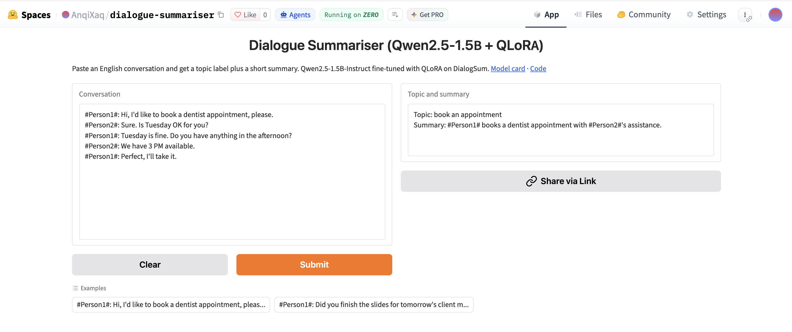
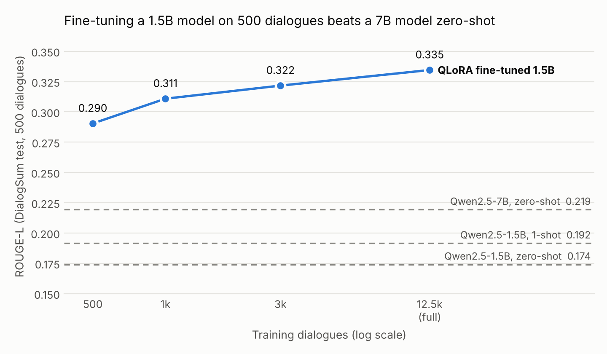

# DialogSum QLoRA: dialogue summarisation with a 1.5B model

Fine-tuning **Qwen2.5-1.5B-Instruct** with **QLoRA** (4-bit NF4 base + LoRA adapters)
to turn a multi-turn conversation into a short structured record:

```
Topic: ask for help
Summary: Tom calls Sara because his daughter has a high fever. Sara agrees to look after his son.
```

Everything runs on a single free Kaggle T4. The project is less about the final
number than about doing the fine-tuning properly: a fair baseline, ablations that
isolate each change, significance tests, and an error analysis.

- **Live demo:** [huggingface.co/spaces/AnqiXaq/dialogue-summariser](https://huggingface.co/spaces/AnqiXaq/dialogue-summariser)
- **Model:** [AnqiXaq/dialogsum-qlora-adapter](https://huggingface.co/AnqiXaq/dialogsum-qlora-adapter) (tags `v2-full`, `v1-3k-1epoch`)
- **Data:** [DialogSum](https://github.com/cylnlp/dialogsum): 12,460 training dialogues; test set of 500 dialogues with 3 reference summaries each



## Key results



| Model | Train | ROUGE‑1 | ROUGE‑2 | ROUGE‑L | BERTScore | Words |
|---|---:|---:|---:|---:|---:|---:|
| Qwen2.5‑1.5B, zero‑shot | 0 | 0.227 | 0.062 | 0.174 | 0.879 | 41.0 |
| Qwen2.5‑1.5B, 1‑shot | 0 | 0.241 | 0.075 | 0.192 | 0.884 | 33.7 |
| Qwen2.5‑7B, zero‑shot | 0 | 0.288 | 0.085 | 0.219 | 0.879 | 39.6 |
| QLoRA 1.5B | 500 | 0.361 | 0.128 | 0.290 | 0.907 | 25.6 |
| QLoRA 1.5B | 1,000 | 0.385 | 0.139 | 0.311 | 0.911 | 22.2 |
| QLoRA 1.5B | 3,000 | 0.399 | 0.149 | 0.322 | 0.914 | 23.3 |
| **QLoRA 1.5B (v2)** | **12,460** | **0.414** | **0.157** | **0.335** | **0.917** | **21.9** |

Train = number of training dialogues. Full DialogSum test set, scores averaged
over the three references of each dialogue. Reference summaries average 18.8 words. Greedy decoding, same prompt for
every model. Raw predictions for every row are in [`results/`](results).

**What the numbers say**

1. **Fine-tuning beats scale.** 500 training dialogues lift the 1.5B model from
   0.174 to 0.290 ROUGE-L, well past Qwen2.5-7B zero-shot (0.219; better on 78% of
   test dialogues, p < 0.001). Both untuned models largely follow the output format
   (100% and 92%) but write about twice as much as the references; a one-shot example barely helps.
   What fine-tuning teaches is the dataset's summary style and length.
2. **More data keeps helping, with diminishing returns.** Each step up the curve is
   significant (500 → 1k: +2.0 ROUGE-L, 1k → 3k: +1.1, 3k → 12.5k: +1.3), but the gain
   per extra dialogue shrinks quickly.
3. **Loss masking is a small effect.** Computing the loss on the summary only,
   instead of on the whole sequence (dialogue included), gives +0.5 ROUGE-L at 3k
   dialogues, consistent in direction across all three ROUGE scores but not
   significant (95% CI [-0.2, +1.2]).

### Where the v1 → v2 gain came from

v1 (3k dialogues, full-sequence loss) scored 0.313 ROUGE-L, v2 scores 0.335. The
ablations split the +2.1 points:

| Change | ROUGE‑L | Δ | 95% CI | p |
|---|---:|---:|---|---:|
| v1 | 0.313 | | | |
| + training setup (shuffled subset, cosine LR, fp16, best checkpoint) | 0.317 | +0.3 | [-0.4, +1.0] | 0.36 |
| + loss on the summary only | 0.322 | +0.5 | [-0.2, +1.2] | 0.13 |
| + all 12,460 dialogues (v2) | 0.335 | +1.3 | [+0.5, +2.1] | 0.001 |

The data is what moved the score. v2 vs v1 overall: +2.1 [+1.3, +3.0], p < 0.001.

### Significance testing

[`analysis/significance.py`](analysis/significance.py) runs a paired bootstrap
(10,000 resamples) over the 500 test **dialogues**. The test file lists each
dialogue three times, once per reference; resampling rows instead would treat
those copies as independent and make every interval look tighter than it is.
p-values are two-sided.

## Error analysis

I read 50 randomly sampled test dialogues next to v2's summaries
([annotations](analysis/error_annotations.csv)):

| Outcome | Count |
|---|---:|
| Faithful and covers the main point | 36 (72%) |
| Unsupported detail or wrong causal link | 8 (16%) |
| Speaker confusion (who did what) | 5 (10%) |
| Faithful details, misses the point | 1 (2%) |

- **Speaker confusion** is the most characteristic failure. DialogSum anonymises
  speakers as `#Person1#` / `#Person2#` and names appear only in passing, so the
  model sometimes binds a name to the wrong tag: in a call where Andy asks for
  Naomi and her sister Nancy answers, v2 writes *"Nancy calls Tyler's house to
  leave a message"*.
- **Unsupported details** are mostly small mis-bindings rather than inventions:
  a "banana-flavored burger" when the banana flavour was for the milkshake, or the
  wrong reason for borrowing money.
- Topic labels are free-form; only 12% match the reference topic exactly, so they
  are useful as tags but are not scored.

The single-annotator analysis is indicative, not a benchmark. ROUGE does not
penalise any of these errors much, which is why the manual pass matters.

## Engineering notes

- **T4 precision.** A T4 reports bf16 as supported but only emulates it. Training
  in fp16 with the trainable LoRA weights kept in fp32 (standard QLoRA master
  weights) made each step about 5× faster than the original bf16 run
  (3.4 s vs 16.1 s per step of 8 dialogues). The full 12,460-dialogue epoch takes 85 minutes.
- **Validation.** Loss on 200 validation dialogues every 200 steps; the best
  checkpoint is kept. v2's validation loss fell from 0.884 to 0.811 and flattened
  near the end of the epoch, with no sign of overfitting.
- **Format.** The target is `Topic: … / Summary: …`, reusing DialogSum's `topic`
  field, so the structure costs no extra labelling. Only the summary is scored.

| Setting | Value |
|---|---|
| Base model | Qwen/Qwen2.5‑1.5B‑Instruct, 4-bit NF4, double quantisation |
| LoRA | r = 16, α = 32, dropout 0.05, all attention and MLP projections (18.5M trainable parameters) |
| Training | 1 epoch, LR 2e-4 cosine, 20 warm-up steps, batch 4 × 2 accumulation, max length 1024, seed 42 |
| Hardware | 1 × NVIDIA T4 (Kaggle) |

## Reproduce

```bash
pip install -r requirements.txt
python train.py --out-dir runs/v2                      # see python train.py --help
python run_eval.py --name v2 --adapter runs/v2/adapter
python compare.py                                      # table of everything in results/
python analysis/significance.py results v2 v1          # paired bootstrap
```

[EXPERIMENTS.md](EXPERIMENTS.md) has the exact Kaggle commands for every run above.

## Repository

```
├── train.py              QLoRA fine-tuning (data size, loss type, LoRA rank, precision as flags)
├── run_eval.py           ROUGE + BERTScore on the test split, saves every prediction
├── compare.py            Markdown table of all eval runs
├── data.py               prompt format shared by training and inference
├── inference.py          summarise one conversation
├── push_to_hub.py        tag the current Hub version, upload a new adapter
├── analysis/             significance test, scaling plot, error annotations
├── results/              predictions, metrics and training logs for every run
├── space/                Gradio demo for a Hugging Face Space (ZeroGPU)
├── hub/README.md         model card for the Hugging Face repo
└── EXPERIMENTS.md        Kaggle runbook
```

## Limitations

- English, everyday two-person conversations only. Meetings, customer support or
  clinical dialogue would need their own data and evaluation.
- ROUGE rewards overlap with one writing style; it barely notices the speaker and
  factual errors described above.
- Each configuration was trained once (seed 42). Differences under one ROUGE point
  should be read together with their confidence intervals.
- DialogSum is licensed CC BY-NC-SA 4.0, so models trained on it inherit a
  non-commercial restriction.
